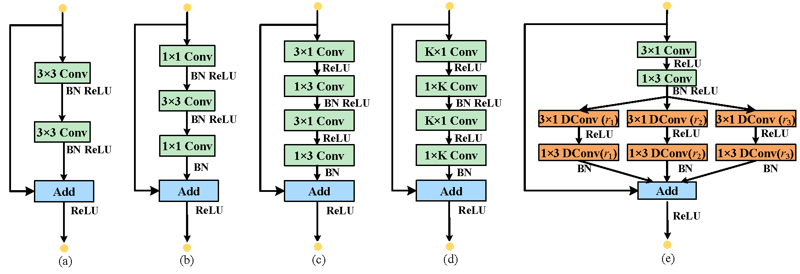
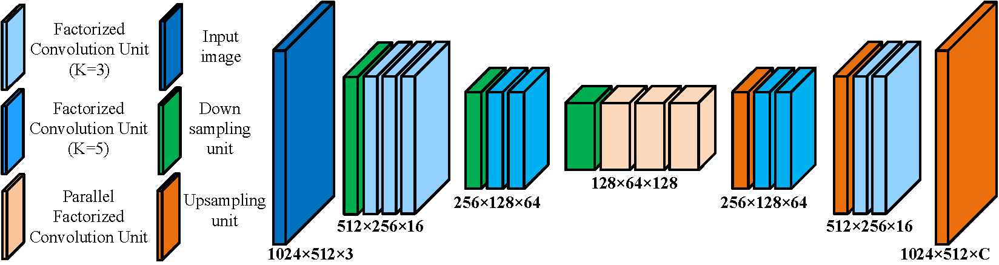

# ESNet

This repository contains the implementation details of our paper: [[arXiv:1906.09826]](https://arxiv.org/pdf/1906.09826.pdf)
"**ESNet: An Efficient Symmetric Network for Real-time Semantic Segmentation**" 
by [Yu Wang](https://github.com/xiaoyufenfei) . 

## About
The recent years have witnessed great advances for semantic segmentation using deep convolutional neural networks (DCNNs). However, a large number of convolutional layers and feature channels lead to semantic segmentation as a computationally heavy task, which is disadvantage to the scenario with limited resources. In this paper, we design an efficient symmetric network, called (**ESNet**), to address this problem.
The whole network has nearly symmetric architecture, which is mainly composed of a series of factorized convolution unit (**FCU**) and its parallel counterparts (**PFCU**). On one hand, the FCU adopts a widely-used 1D factorized convolution in residual layers. On the other hand, the parallel version employs a transform-split-transform-merge strategy in the designment of residual module, where the split branch adopts dilated convolutions with different rate to enlarge receptivefield. Our model has nearly 1.6M parameters, and is able to be performed over 62 FPS on a single GTX 1080Ti GPU card. The experiments demonstrate that our approach achieves state-of-the-art results in terms of speed and accuracy trade-of for real-time semantic segmentation on CityScapes dataset.

## Dependencies
- [**Python 3.6.x** ](https://www.python.org/)
- [**Pytorch 1.1**](https://pytorch.org/), also support torch version >= 0.4.1

## Units Design
<p align="center"></p>

## Architecture
<p align="center"></p>

## Pakages
This repository is organized as:
- [models](https://github.com/xiaoyufenfei/ESNet/models) contains the layer configuration of **ESNet** introduced in our paper.
- [train](https://github.com/xiaoyufenfei/ESNet/train) contains the training details and the **class weights** used to train our networks.
In our implementation, **PyTorch (>= v0.4.1)** is used to perform all the experiments.

## Implementation:
Flow the steps presented below:
-  Clone this repository.
```
git clone https://github.com/xiaoyufenfei/ESNet.git
cd ESNet-master
```
- You can download [cityscapes](https://www.cityscapes-dataset.com/) from [here](https://www.cityscapes-dataset.com/downloads/). Note: please download [leftImg8bit_trainvaltest.zip(11GB)](https://www.cityscapes-dataset.com/file-handling/?packageID=4) and [gtFine_trainvaltest(241MB)](https://www.cityscapes-dataset.com/file-handling/?packageID=1) and [gtCoarse(1.3GB)](https://www.cityscapes-dataset.com/file-handling/?packageID=1).  **Please note that for training you should use the "_labelTrainIds" and not the "_labelIds", you can download the [cityscapes scripts](https://github.com/mcordts/cityscapesScripts) and use the [conversor](https://github.com/mcordts/cityscapesScripts/blob/master/cityscapesscripts/preparation/createTrainIdLabelImgs.py) to generate trainIds from labelIds**.
```
├── leftImg8bit
│   ├── train
│   ├──  val
│   └── test
├── gtFine
│   ├── train
│   ├──  val
│   └── test
├── gtCoarse
│   ├── train
│   ├── train_extra
│   └── val
```
-  Set the global file path in the very bottom of `main.py` in `train` file. 
-  Then the trained model and the validation results will be saved in the `saveDir`file you specify. 

## Evaluation
**Accuracy:**  ESNet achieves a mIoU scores of **70.7 %** on the Cityscapes dataset without any pretrained model.

**Speed:**  For the resolution 512x1024 input, ESNet can run at the speed of  **63** FPS on a singel GTX 1080 Ti, respectively.

Please refer to our article for more details [arXiv Link](https://arxiv.org/abs/1906.09826) .

This implementation has been tailored to suit the [Cityscapes](https://www.cityscapes-dataset.com/)  , sample results:

<p align="center">
	
</p>

and [Camvid](http://mi.eng.cam.ac.uk/research/projects/VideoRec/CamVid/)  dataset sample results:

<p align="center">
	
</p>


## Citing ESNet
If you feel our ESNet is useful for your research, please consider citing our paper: 

```
@article{wang2019esnet,
    Author = {Wang, Yu and Zhou, Quan and Wu, Xiaofu},
    Title = {ESNet: An Efficient Symmetric Network for Real-time Semantic Segmentation},
    Journal = {arXiv preprint arXiv:1906.09826},
    Year = {2019}
} 
```