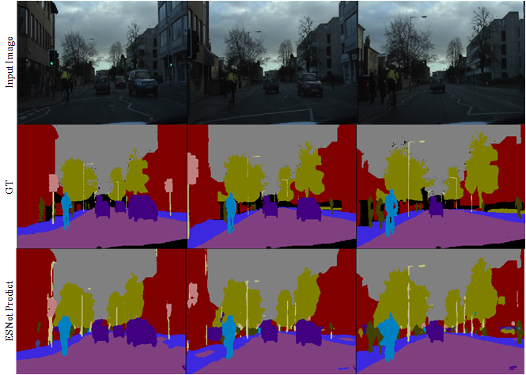

### ESNet
PyTorch (v0.4.1) implementation of [*ESNet: An Efficient Symmetric Network for Real-time Semantic Segmentation*](https://github.com/xiaoyufenfei/ESNet/blob/master/xxx), created by the [Yu Wang](https://github.com/xiaoyufenfei/ESNet).

This implementation has been tailored to suit the [Cityscapes](https://www.cityscapes-dataset.com/)  and [Camvid](http://mi.eng.cam.ac.uk/research/projects/VideoRec/CamVid/)  dataset.

	

	

